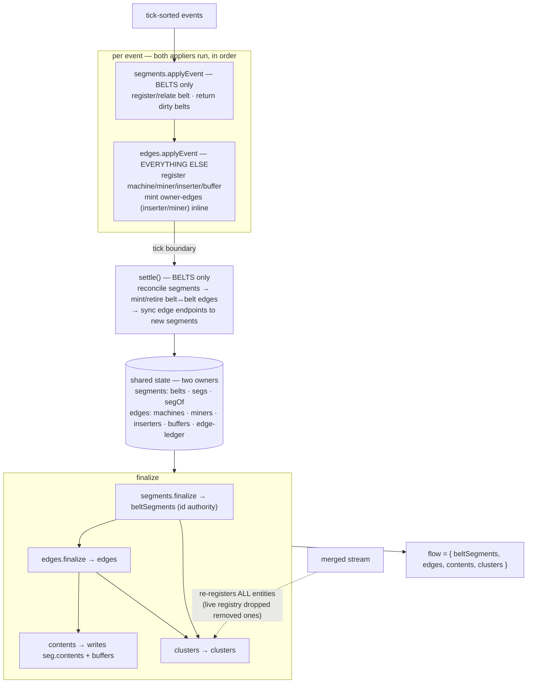

# Flow pipeline — review & cleanup plan

> **Status:** working plan. Belt **over-split / over-merge** is tracked on a **separate fork** — deliberately
> out of this doc. What remains here is structural cleanup, not correctness.
>
> Reference for *what* the pipeline emits: [docs/architecture/flow_feature.md](../architecture/flow_feature.md).

## 1. The pipeline today

Two appliers run **per event**; a settle step runs **per tick** (belts only); then finalize derives the
emitted records.

The design follows a clear philosophy — **one module per object in the flow**:

| Module | Object it owns |
|---|---|
| `state` | the shared store |
| `segments` | the belt graph (belts → connected runs) |
| `edges` | hand-offs (inserter / miner-drop / belt→belt) |
| `clusters` | nodes (machines / furnaces / miners / buffers, grouped) |
| `contents` | items on belts / in buffers |
| `flow-prep` | runs the whole thing |

**This philosophy is sound.** The issues below are local — reasons to tidy, not to replace it.

## 2. Three things worth fixing

**(2) Node data has no single home.** Node info — a machine's recipe over time, a miner's resource, a
buffer's item — is needed by `edges`, `contents`, and `clusters`. Today `edges` keeps a **live** copy (it
forgets a node the moment it's removed), and `clusters` — which needs the **full** history — can't use that
copy, so it rebuilds node data from scratch off the `merged` stream. Same data, built twice; and it's why a
module called "edges" ends up registering machines and buffers.

**(3) The driver is implicit.** `flow-prep` wires the modules together — most visibly, it hand-routes
`segments`' belt-edge events into `edges` and juggles the `dirty`/`moved` sets — and enforces order purely by
call sequence. The rules are correct but invisible at the call site.

**(4) Copy-pasted helpers.** `numId` (S-n↔n) ×2, half-open interval math ×3 (two byte-identical),
footprint/bbox geometry ×2. Each makes a format change an N-place edit.

## 3. Suggestions

**(2) → one full-history node owner.** A single module builds every node's complete history **once**, from the
`merged` stream (which is already the full lifetime log): position, footprint, recipe-over-time, resource,
stored item. Then `edges` reads it during the loop (to resolve what an inserter reaches), and
`contents` / `clusters` read the same. `edges` stops registering machines / miners / buffers — it keeps only
**inserters** (which are genuinely edges) plus the hand-off ledger; `clusters` stops rebuilding from `merged`.

- *Why it's safe:* this centralizes a parse that **already happens twice** — no new logic in how `edges`
  computes hand-offs or how `segments` works. Diff `clusters` output before/after to confirm it's identical.
- *Resolves:* "what are edges?" and the double-build, in one move.
- *Note:* the miner is a dual citizen — a **node** (clustered, lives in the new owner) that also **owns** a
  drop-edge (the edge layer references it). That's consistent, not a conflict.

**(3) → make the phases explicit (cheap); defer the deep version.**
- *Cheap win:* name the loop's phases and write the ordering rules as short contracts where modules meet —
  especially, have `segments.settle()` **return** its belt-edge deltas + moved set as one result that `edges`
  consumes in a single call, instead of `flow-prep` hand-routing events. Behavior identical; order becomes legible.
- *Deep version (separate fork):* "should `edges` run in the loop at all, or be computed at the end?" Higher
  risk, set aside. The cheap win stands on its own regardless.

**(4) → extract the duplicated helpers** into shared modules: `segId`, interval math, node geometry. **Do this
after (2)** — (2) creates the node module where geometry naturally belongs, so you move it once, not twice.

## 4. Sequencing

Superseded by the agreed execution plan in
[docs/specs/flow_pipeline_structure.md](../specs/flow_pipeline_structure.md) — which also promotes the "deep
version" of (3) (edges computed at finalize, the loop reduced to the one sequential computation) from a
deferred fork to the stated destination, and adds verification gateways between steps. Over-split remains a
separate fork.
