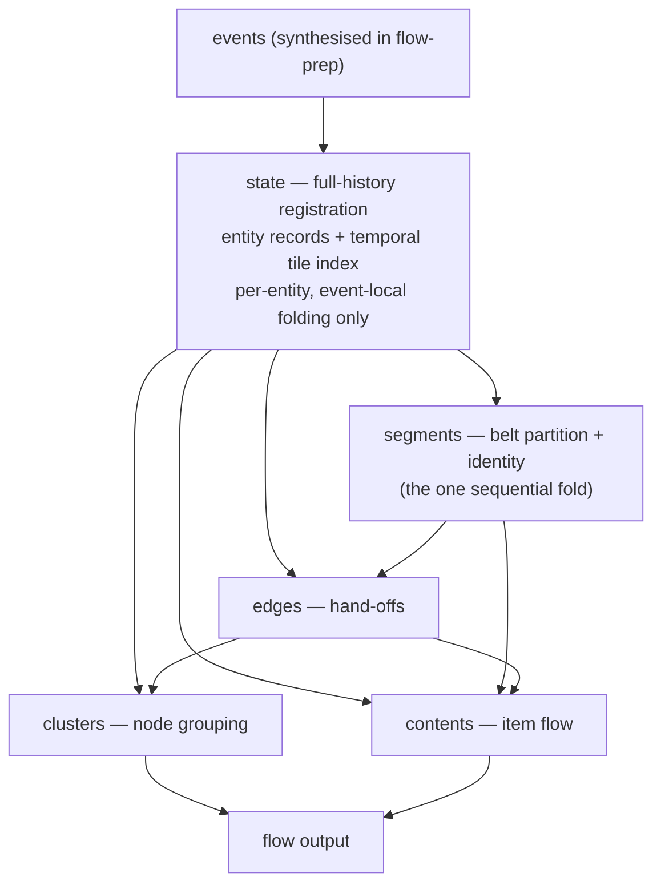
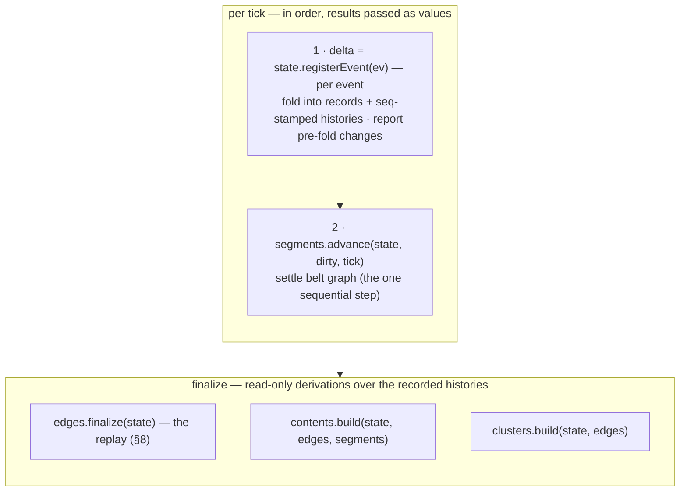

# Flow pipeline — structure spec

> **Status:** agreed target + execution plan. A **pure structural refactor** of the flow build, executed in
> gated steps — the emitted `flow` payload is preserved at every step (the one declared exception is step 0,
> which only fixes an emission *ordering*). Motivation and problem inventory:
> [docs/refactors/flow_pipeline_refactor.md](../refactors/flow_pipeline_refactor.md). What the pipeline emits:
> [docs/architecture/flow_feature.md](../architecture/flow_feature.md).
>
> **Out of scope** (separate fork): belt over-split / over-merge.

## 1. Why — and the destination

The pain is development-oriented: the module is unfinished, already hard to grasp, and fragile. Each module is
locally careful, but **correctness hangs on cross-module ordering invariants that live in nobody's file** —
apply-before-settle, dirty-set-before-mutation, belt-edge events routed by the driver in emission order, live
registries that must be read at exactly the right moment. Every one is correct, and every one is invisible
until violated.

The structural fact underneath: the pipeline contains exactly **one inherently sequential computation — belt
segment identity**. Oldest-wins / largest-keeps-id is path-dependent, so ticks must fold in order. Nothing
else is: `clusters` and `contents` are already finalize passes, and `edges` — though it runs live inside the
loop — is already shaped like a batch derivation (tile-anchored edges, retro-attach, segment resolved on
demand).

**Destination: the per-tick loop contains only the sequential computation.** Registration folds into `state`,
segments advance, and everything else — edges included — derives at finalize from full-history records.

## 2. Principles

1. **One module per object**, and **registration is separated from derivation.** `state`'s registration is
   *per-entity, event-local folding*: it may never read another entity's record and never compute a relation.
   (That is the enforceable line — "no logic" isn't, since folding `mutated`/`replaced`/`recipe-changed`
   events into timelines is itself logic.)
2. **Modules communicate by passed values, not by poking shared mutable state in a load-bearing order.**
   `state.register` *returns* the tick's deltas; `segments.advance` *returns* its segment changes. Ordering
   becomes visible data-flow.

## 3. Target responsibilities

| Module | Owns | Reads |
|---|---|---|
| `state` | **full-history registration** — records for ALL entities (belts, machines, miners, inserters, buffers): lifetime (`tb`/`tr`), recipe/resource/item timelines, geometry, **and the temporal tile→entity index**. Nothing is deleted on removal. `register(events)` → the tick's **deltas** (old→new per touched entity). | events |
| `segments` | belt-segment partition + identity (`segOf`, lineage) — *the* sequential fold | belt records + deltas from `state` |
| `edges` | hand-off ledger (inserter / miner-drop / belt→belt) — destination: a **finalize-time temporal join** | `state` records + segment timelines |
| `clusters` | node grouping (finalize) | `state` records + `edges` |
| `contents` | item-on-belt / buffer ledgers (finalize) | `segments` + `edges` + `state` buffer records |
| `flow-prep` | the driver: event synthesis + the loop + finalize | — |

Belts register in `state` like everything else: they are multi-consumer (edges reads belt direction and
records for lane-side computation, plus `segOf` for segment timelines), so the shared registrar is their home;
`segments` keeps only the partition logic. **Belt records keep live-delete semantics for now** (removal
deletes the record): every consumer reads absence as "gone" (`sameSegmentNeighbours`, reconcile's departure
pass, `resolveBeltEdge`), and nothing consumes belt history before the edges→finalize step — full-history
belt records land with step 4, which is what needs them.

## 4. The per-tick contract

The loop's unit is the **tick**, not the event (belt reconcile is only valid once *all* of a tick's events
have landed). Each step takes the previous step's result **as a value**:

**Why deltas, not just `state`:** segments' dirty set *intentionally* depends on prior **and** current state —
`dirtyMark` reads a belt's pre-mutation neighbor links (the neighbors a removed belt *had*). Once `state`
folds the tick first, that prior state is gone unless the fold returns it. So `register` returns the tick's
deltas (old→new per touched entity), and downstream consumes those. The same deltas tell `edges` which nodes
are new this tick.

**Registration granularity (execution finding):** registration folds **per event**, not as a per-tick batch.
Mid-tick tile-index reads are observable — an owner edge minted at event *k* resolves its endpoint against the
index as of event *k*; batch-folding the whole tick first changes which same-tick open-then-close endpoint
intervals get emitted. The phase rule therefore holds *within each event*: register → segments-apply →
edges-apply, with the per-tick settle unchanged.

**Honest limit:** `segments` is not a pure function — belt identity is path-dependent, so it carries state
across ticks. "Atomic" means one-tick-in / changes-out, not stateless. At the destination it is the *only*
module with that property.

## 5. What moves

- **All registration → `state`** as full-history records. Kills the `clusters` double-build (it currently
  re-registers every entity from the `merged` stream because the live registry forgets removed ones) and the
  `segments`→`tileEntities` cross-write. **Migration footgun:** code that uses *absence from the live
  registry* as "retired" (e.g. the lane-side fallback at `edges.mjs:570-576`) must become a
  liveness-at-tick check; the diff gate verifies each conversion.
- **belt→belt hand-off becomes a return value.** Today `flow-prep` hand-routes `segments.reconcile`'s
  belt-edge events into `edges.mintBeltEdge`/`retireBeltEdge` and juggles `dirty`/`moved`. Instead
  `segments.advance` returns its segment changes (belt-edge deltas + moved units, in emission order) and
  `edges` consumes them in one call.
- **`edges` moves to finalize** — the destination step. With full-history records and finished segment
  timelines, the hand-off ledger is a pure temporal join (the live design already half-admits this: "the edge
  waits on the tile"). This step deletes the fragility outright: `settle()`'s event routing,
  `updateSegments`, the dirty/moved juggling, and every intra-tick ordering question cease to exist. The loop
  ends as two calls.

## 6. Gateways

Run after **every** step, before starting the next:

1. **Nothing broken.** `npm test` (vitest) in `dashboard/`, then rebuild the reference run and **byte-diff
   the emitted `flow` payload** against the previous step's output. It must be identical except where the
   step's declared delta says otherwise (only step 0 declares one: `tileLocations` reordering). Any other
   difference is a regression, not progress.
2. **Traceability.** Each step must delete — or convert into explicit data-flow — at least one hidden
   ordering rule. Name which one in the step's summary/commit.
3. **Size.** Net LOC of the flow code should trend **down**. Baseline (2026-06-10, before step 0):

   | File | Lines |
   |---|---|
   | `flow-prep.mjs` | 355 |
   | `lib/flow/segments.mjs` | 403 |
   | `lib/flow/edges.mjs` | 609 |
   | `lib/flow/contents.mjs` | 442 |
   | `lib/flow/clusters.mjs` | 438 |
   | `lib/flow/state.mjs` | 80 |
   | **Total** | **2327** |

   Record the table again at each gate. (Steps that *move* code may be near-flat; the trend across steps must
   be negative, with the edges→finalize step expected to deliver the bulk.)

   Progress: after step 0 — 2330; after step 1 — 2346; after step 2 — 2370 (`edges` 609→524, `clusters`
   438→407, `state` 80→224; the moves cost their documentation); after step 3 — 2362 (`segments` 449→333,
   `state` 224→304, `flow-prep` 355→352 — first net decrease); after step 4 — 2328 (`edges` 524→448,
   `flow-prep` 352→340, `state` 304→354, `segments` 333→337). One line above baseline; step 5 owes the rest.

## 7. Sequencing

0. ✅ **Determinism sort** (2026-06-10). `beltSegments[].tileLocations` was emitted in Map-insertion order
   (reconcile's merge/recut order) — the one insertion-order leak in the payload; cluster ports were already
   sorted by `dedupEdges`. Explicit sort added so the byte-diff gate is trustworthy for every later step.
   *Gate: diff = reordering within `tileLocations` only (12,748 positions moved, nothing else); 23/23 tests.*
1. ✅ **Loop phases explicit** (2026-06-10). `segments.advance` settles the tick and returns
   `{beltEdges, moved}` as one value; `edges.advance` consumes it. The driver no longer inspects segment-event
   types; `mintBeltEdge`/`retireBeltEdge`/`updateSegments` are no longer exported. *Gate: byte-identical;
   23/23 tests.*
2. ✅ **Node registration → `state`** (2026-06-10). `state.registerEvent` folds machine/miner/inserter/buffer
   events into full-history records (+ tile index); `edges` does only edge work, with `liveRec`/`recTb` guards
   preserving the old absence-means-removed semantics; `clusters` reads `state` instead of re-registering from
   `merged` (double-build gone). Buffers' `storedItemDominant` rides the built event. *Gate: byte-identical
   (one intermediate failure — dead miners linger in the tile index, fixed by the `recTb` live guard);
   23/23 tests.*
3. ✅ **Belt registration → `state`** (2026-06-11). `registerEvent` folds belt events and returns
   `{ dirty }` — the pre-fold dirty mark — so the driver's per-event sequence collapses to
   register → edges-apply; `segments.applyEvent` is gone (the module keeps only classification + lifecycle).
   Belt records stay live-delete (decision recorded in §3 — full-history belts arrive with step 4).
   *Gate: byte-identical; 23/23 tests.*
4. ✅ **`edges` → finalize** (2026-06-11). The ledger is derived by `edges.finalize(state)` replaying
   seq-stamped histories (design: §8); `edges.applyEvent`/`edges.advance`, `updateSegments`, the endpoint
   morphing, `edgesByTile` and the live-vs-rebuilt oracle are gone — the loop is two calls, and every
   intra-tick edge-ordering rule is now data (`seq`). One intermediate gate failure: raw per-join membership
   timelines exposed mid-settle transient hops (a belt passing through a segment that immediately merges
   away) that the live `updateSegments` — running once per settle with the final `segOf` — never saw; fixed
   by compacting `segTl` to one entry per tick, last join wins. *Gate: byte-identical; 22/22 tests (the
   live-vs-rebuilt oracle test retired with the oracle).*
5. **Cleanup & condense** — the explicit size step; the refactor is not done while the count is up. Targets:
   dedupe `numId` (×2), interval intersection (×3), and tile/footprint geometry (now split across `state`,
   `edges`, `clusters`); move event synthesis out of `flow-prep` into its own module so the driver reads as
   one screen; the live-vs-rebuilt edge oracle (`liveEdgeKeys`/`rebuildLiveEdgeKeys`) moves to diagnostics or
   dies with step 4; strip transitional comments that only explain the pre-refactor shape.
   *Diff: identical. Gate-3 target: total LOC strictly below the 2026-06-10 baseline (2327).*

### Quirks discovered and preserved (candidates for a later behavior fork)

The live registries' absence-means-removed semantics hid real data loss; full-history records had to add
explicit guards (`liveRec` in `edges.mjs`) to keep the output byte-identical:

- A machine removed before finalize contributes **no drain windows** to edges that drained it.
- A miner removed before finalize loses its **`itemWindows` entirely** (its drop edge carries no item).
- An inserter removed before finalize loses its **transfer filter**.
- A removed **miner's tiles stay in the tile index** forever (machines/buffers clear theirs).

Removing the guards (and clearing miner tiles) is a small, deliberate behavior change once this refactor
lands — each guard's comment marks the spot.

## 8. Step 4 internal design — record, then replay

Decided at step start. The byte-identical gate forces the join to reproduce mid-tick observability (the step-2
finding) and every preserved quirk, so the design is **event-sourcing**: the loop records seq-stamped
histories; `edges.finalize` replays them.

**Loop-time — nothing edge-shaped runs.** The loop is literally two calls (`registerEvent`,
`segments.advance`); `edges.applyEvent`/`edges.advance` cease to exist. What they maintained becomes
history recording:

- `state.seq` — one monotone counter bumped per recorded action. Ticks order the run; seqs order *within*
  a tick (mid-tick reads are observable, so tick-resolution timelines are not enough).
- **Tile log** — the live tile index becomes per-tile occupancy *intervals* (`seqB`/`seqR`), written by
  exactly today's call sites (node registration, segments' join/leave). Current occupant = last open interval.
- **Passive log** — per-tile open/close/rotate entries at the event moments where
  `openEndpointAt`/`closeEndpointAt`/`refreshSidesAt` fire today: machines+buffers on their footprint tiles
  at build/remove; belts at `floorTile(location)` at build/replace/remove/rotate. Miners never log — they
  were owner-only (their lingering-seed behavior rides the tile log).
- **Owner histories** — inserter/miner records carry a direction timeline; each direction interval is one
  edge shell (rotation = retire + mint, as today).
- **Belt history** — `state.belts` stays the live-delete working set the partition reads; the same record
  objects also land in `state.beltHist` (removal stamps `tr`, record kept) and carry direction +
  segment-membership timelines (membership appended by segments' `join`).
- **Belt-edge log** — `segments.advance` appends reconcile's belt-edge deltas to `state.beltEdgeLog`
  (emission order, seq-stamped). `updateSegments` dies — membership timelines replace it.

**Finalize-time — `edges.finalize(state)` replays.** Shells (id chronology = mint-seq order across owner
builds/rotations + belt-edge-added entries, no-op mints consuming no id) → per-endpoint fold (seed from the
tile log at mint seq with the recTb liveness rule; arrivals/leaves/rotations from the passive log; `side` =
last side-write; `segs` = membership overlay with the same dedupe / zero-length-interval semantics) →
`annotateContents` (unchanged). JSON key-insertion order is replicated case-by-case — the byte gate enforces
it.

The live-vs-rebuilt oracle dies here (the join *is* a from-scratch rebuild); `flowEdges.test.ts` re-asserts
its segment invariants against the built ledger instead of live state.
